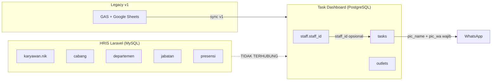

# Integrasi HRIS (presensigpsv2) ↔ Task Dashboard (nusafood-v2)

Dokumen ini merangkum audit read-only, rencana implementasi, dan panduan deployment integrasi staf.

---

## FASE 1 — AUDIT

### 1.1 Task Dashboard (`nusafood-v2`)

| Aspek | Temuan |
|-------|--------|
| **Struktur** | Monorepo Turborepo: `apps/web` (Next.js 16), `packages/database` (Prisma/PostgreSQL), `packages/types`, `packages/api-client` |
| **Framework** | Next.js 16.2.6, React 19, Prisma 6.11, PostgreSQL (Supabase) |
| **Auth** | JWT session cookie (`nusa_session`) + bcrypt; owner via `ADMIN_PASSWORD`; role `ADMIN \| LEADER \| STAFF` |
| **Database staf** | Tabel `staff` — PK internal UUID, business key `staff_id` (`STF-YYYYMMDD-XXX`) |
| **Identitas staf saat ini** | `staff_id` lokal, `name`, `wa_number`, `outlet_id`, `area_id`, `position` (grup posisi) |
| **Task assignment** | **Hybrid**: `pic_name` + `pic_wa` wajib (denormalized); `staff_id` opsional FK ke `staff.staff_id` |
| **API existing** | REST lengkap (`/api/staff`, `/api/tasks`, …); sync dari GAS v1 (`/api/sync/from-v1`) |
| **RBAC** | ADMIN = semua outlet; LEADER = outlet sendiri; STAFF = token public routes saja |
| **Integrasi HRIS** | **Belum ada** — tidak ada field `hris_*`, tidak ada client API HRIS |

### 1.2 HRIS Laravel (`presensigpsv2`)

| Aspek | Temuan |
|-------|--------|
| **Struktur** | Laravel 10 monolith, Blade + Vite, 67 migrations, 38 models |
| **Framework** | Laravel 10.48, PHP 8.1+, MySQL |
| **Auth** | Session (Breeze) + Spatie Permission; Sanctum terpasang tapi **tidak dipakai** untuk API bisnis |
| **Entitas staf** | Tabel `karyawan`, **PK = `nik` (char 9)** — bukan UUID |
| **Outlet** | `cabang` — PK `kode_cabang` (char 3) |
| **Divisi** | `departemen` — PK `kode_dept` (char 3) |
| **Jabatan** | `jabatan` — PK `kode_jabatan` (char 3) |
| **Presensi** | `presensi`, izin/sakit/cuti terpisah |
| **API existing** | Hanya `/api/presensi` (mesin fingerprint, **tanpa auth**) + `/api/user` (Sanctum) |
| **Role HRIS** | Spatie: `super admin`, `karyawan`, `admin pusat`, `gm administrasi` — **tidak ada role leader** |
| **Integrasi eksternal** | Fingerspot, WA gateway — tidak ada endpoint staf untuk sistem lain |

### 1.3 Diagram alur data saat ini



### 1.4 Risiko utama

| Risiko | Dampak | Mitigasi |
|--------|--------|----------|
| Duplikasi staf | Task & HRIS punya ID berbeda | `hris_staff_id` (NIK) unique + upsert |
| Mapping outlet beda kode | KBU vs kode_cabang `001` | Tabel/kolom `hris_outlet_code` di `outlets` |
| Assignment by name/WA saja | Nama sama, WA berubah | Wajibkan `staff_id` + backfill `hris_staff_id` |
| Staf pindah outlet | Leader lihat data salah outlet | Sync update `outlet_id`; task lama tetap di outlet saat dibuat |
| Staf nonaktif | Task orphan | Soft inactive, jangan hard delete |
| HRIS expose password/gaji | Kebocoran data | Allowlist field di Integration API |
| Endpoint presensi terbuka | Abuse | Integration API pakai token + rate limit |

### 1.5 File yang perlu diubah

**HRIS (Laravel):**
- `routes/api.php` — tambah prefix integration
- `app/Http/Middleware/VerifyTaskDashboardIntegrationToken.php` (baru)
- `app/Http/Controllers/Integration/V1/*.php` (baru)
- `config/integration.php` (baru)
- `.env.example`

**Task Dashboard:**
- `packages/database/prisma/schema.prisma` + migration
- `apps/web/lib/services/hris-*.ts` (baru)
- `apps/web/app/api/internal/hris/*` (baru)
- `apps/web/app/(admin)/settings/hris-integration/*` (baru)
- `packages/types/src/index.ts` — extend Staff type
- `.env.example`

### 1.6 Rekomendasi arsitektur

```
HRIS Laravel
  └─ GET /api/integration/v1/*  (Bearer token)
        ↓ HTTPS
Task Dashboard backend (server-only)
  └─ HrisApiClient → StaffSyncService → PostgreSQL staff.hris_staff_id
        ↓
Task assignment via staff.staff_id (linked to hris_staff_id)
```

**ID permanen:** `nik` dari HRIS → disimpan sebagai `hris_staff_id` dan `hris_employee_code`.

### 1.7 Pertanyaan belum terjawab dari source code

1. Mapping pasti `kode_cabang` HRIS → outlet Task Dashboard (KBU/KISAMEN/SAMTARO) — perlu konfirmasi admin.
2. Apakah NIK selalu 9 digit dan unik di produksi `squadnfi_hris`?
3. Role leader di Task Dashboard — apakah ditentukan dari `jabatan` HRIS atau manual?
4. URL produksi HRIS API (`https://squadnf3.id`?) dan apakah HTTPS sudah aktif.
5. Apakah repo produksi HRIS = `sabsensi6/presensigpsv2` atau fork internal?

---

## FASE 2 — RENCANA PERUBAHAN

### 2.1 Schema Task Dashboard (backward-compatible)

**Tabel `staff` — kolom baru:**

| Kolom | Tipe | Keterangan |
|-------|------|------------|
| `hris_staff_id` | VARCHAR(50) UNIQUE NULL | NIK dari HRIS |
| `hris_employee_code` | VARCHAR(50) NULL | Duplikat NIK untuk lookup |
| `hris_outlet_code` | VARCHAR(50) NULL | kode_cabang cache |
| `hris_division_code` | VARCHAR(50) NULL | kode_dept cache |
| `hris_division_name` | VARCHAR(100) NULL | nama_dept cache |
| `hris_position_code` | VARCHAR(50) NULL | kode_jabatan cache |
| `hris_position_name` | VARCHAR(100) NULL | nama_jabatan cache |
| `hris_link_status` | ENUM | LINKED, UNLINKED, AMBIGUOUS, MANUAL_REVIEW |
| `hris_synced_at` | TIMESTAMPTZ NULL | Waktu sync terakhir |

**Tabel `outlets` — kolom baru:**

| Kolom | Tipe | Keterangan |
|-------|------|------------|
| `hris_outlet_code` | VARCHAR(50) UNIQUE NULL | Mapping ke kode_cabang |

**Tabel baru `hris_sync_logs`:** audit setiap run sync.

Kolom lama **tidak dihapus**. Task lama tetap pakai `pic_name`/`pic_wa`.

### 2.2 Endpoint HRIS baru

Prefix: `/api/integration/v1` — auth: `Authorization: Bearer {TASK_DASHBOARD_API_TOKEN}`

| Method | Path | Filter |
|--------|------|--------|
| GET | `/staff` | updated_since, page, per_page, status, outlet_id, division_id |
| GET | `/staff/{id}` | — |
| GET | `/outlets` | — |
| GET | `/divisions` | — |
| GET | `/positions` | — |
| GET | `/attendance/today` | outlet_id, division_id |

File referensi: `integrations/hris-laravel/` (copy ke project Laravel produksi).

### 2.3 Service Task Dashboard

- `HrisApiClient` — HTTP + retry + timeout
- `HrisStaffSyncService` — upsert, mapping, backfill
- `HrisIntegrationService` — status koneksi

### 2.4 Mapping staf lama

Prioritas (bukan nama saja):

1. `hris_staff_id` / NIK exact
2. `wa_number` + outlet match
3. NIK partial via `hris_employee_code`
4. Ambigu → `MANUAL_REVIEW`

### 2.5 Environment variables

**Task Dashboard:**
```env
HRIS_API_BASE_URL=https://squadnf3.id
HRIS_API_TOKEN=
HRIS_SYNC_ENABLED=false
```

**HRIS Laravel:**
```env
TASK_DASHBOARD_INTEGRATION_ENABLED=true
TASK_DASHBOARD_API_TOKEN=
```

### 2.6 Rollback

1. Set `HRIS_SYNC_ENABLED=false`
2. Rollback migration Task Dashboard (kolom nullable — aman)
3. Hapus route integration di HRIS atau set `TASK_DASHBOARD_INTEGRATION_ENABLED=false`

---

## FASE 3 — Implementasi

Lihat file di repo:
- `integrations/hris-laravel/` — modul Laravel siap salin
- `apps/web/lib/services/hris-*.ts`
- `apps/web/app/api/internal/hris/`
- `apps/web/app/(admin)/settings/hris-integration/`

---

## Deployment manual

### HRIS

```bash
# Di server Laravel presensigpsv2
cp -r integrations/hris-laravel/app/* app/
cp integrations/hris-laravel/config/integration.php config/
# Tambahkan require routes/integration-v1.php di routes/api.php (lihat INSTALL.md)
php artisan config:cache
```

### Task Dashboard

```bash
pnpm db:generate
pnpm db:migrate        # JANGAN otomatis di produksi — review dulu
# Isi HRIS_API_* di .env server
pnpm test
```
